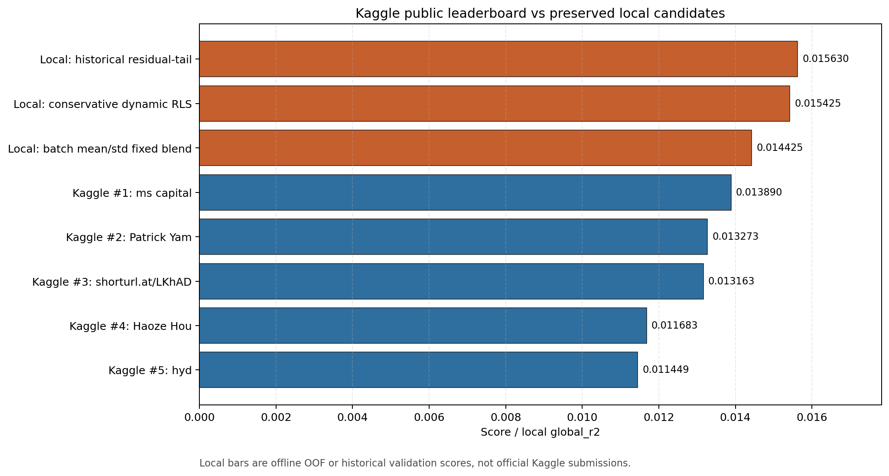

# Jane Street Real-Time Market Data Forecasting Research

This repository is a local quantitative research workspace for the Kaggle Jane
Street Real-Time Market Data Forecasting competition. It contains temporal
validation code, model experiments, meta-learning layers, submission packaging
utilities, audit notes, and preserved best-candidate artifacts.

The project is research-oriented rather than a minimal Kaggle starter kit. Its
main goal is to test forecasting ideas under causal temporal validation, keep
strong reference results reproducible, and separate validated evidence from
probes, smokes, and post-hoc diagnostics.

## Current Preserved References

The most important results are preserved under `best-candidates/`. Each
candidate directory contains its own `README.md`, `ARTIFACTS.md`, `CODE.md`,
generated outputs, and a code snapshot.


| Directory                                           | Role                                        | Preserved reference                                                                                                                                         | Score                                                               |
| --------------------------------------------------- | ------------------------------------------- | ----------------------------------------------------------------------------------------------------------------------------------------------------------- | ------------------------------------------------------------------- |
| `best-candidates/batch_mean_std_fixed_blend/`       | Best local Stage 3 reference                | `strong_oof_subset_s23aux8_s17_gateway_batch_mean_std_stage3_narrow_v1/fixed_blend_0_w0p75_fixed_blend`                                                     | Stage 3 `global_r2=0.014424968604`                                  |
| `best-candidates/historical_residual_tail/`         | Best full historical reference              | `strong_oof_hist_max1398_gateway_residual_tail_modes_v1/gateway_risk_conservative_rls_abs_pred_s100_prediction_residual_weight_and_abs_q0p95_residual_tail` | Historical `global_r2=0.015630171202`                               |
| `best-candidates/conservative_dynamic_gateway_rls/` | Lowest operational-risk preserved reference | `dynamic_gateway_rls_experts_alpha10000_f0p995`                                                                                                             | Stage 3 `global_r2=0.013836465`; historical `global_r2=0.015425344` |


Read `best-candidates/README.md` first if your goal is to reproduce or audit
the preserved results.

## Leaderboard Context

The table below compares preserved local validation scores with the top public
Kaggle leaderboard scores on the same numeric scale. The Kaggle rows are from a
public leaderboard CSV downloaded with:

```bash
kaggle competitions leaderboard \
  -c jane-street-real-time-market-data-forecasting \
  --download
```

The downloaded file was named
`jane-street-real-time-market-data-forecasting-publicleaderboard-2026-05-27T18:57:31.csv`.

Kaggle references:

- Competition page:
  [https://www.kaggle.com/competitions/jane-street-real-time-market-data-forecasting](https://www.kaggle.com/competitions/jane-street-real-time-market-data-forecasting)
- Leaderboard:
  [https://www.kaggle.com/competitions/jane-street-real-time-market-data-forecasting/leaderboard](https://www.kaggle.com/competitions/jane-street-real-time-market-data-forecasting/leaderboard)
- Data page:
  [https://www.kaggle.com/competitions/jane-street-real-time-market-data-forecasting/data](https://www.kaggle.com/competitions/jane-street-real-time-market-data-forecasting/data)
- Rules:
  [https://www.kaggle.com/competitions/jane-street-real-time-market-data-forecasting/rules](https://www.kaggle.com/competitions/jane-street-real-time-market-data-forecasting/rules)

Important interpretation boundary: the preserved project rows are offline OOF,
historical, or Stage 3 validation results, not official Kaggle submissions.
They are useful for score-scale context, but they do not assign an official
competition rank to these candidates.

How to read the validation labels:


| Label                  | Plain meaning                                                                                                          | What it proves                                                                                  | What it does not prove                                                              |
| ---------------------- | ---------------------------------------------------------------------------------------------------------------------- | ----------------------------------------------------------------------------------------------- | ----------------------------------------------------------------------------------- |
| `Stage 3`              | The strict local recency test. It focuses on later temporal folds, closer to the end of the available training period. | The method still works in the recent local regime used for final model selection.               | It does not prove the exact Kaggle public/private leaderboard score.                |
| `Historical`           | A wider temporal confirmation test over an earlier historical cutoff.                                                  | The method is not only tuned to one recent local window and can survive a broader regime check. | It is not more official than Stage 3 and is not a Kaggle submission.                |
| `Kaggle runtime`       | The code is shaped to run inside the competition-style `predict(test, lags)` gateway.                                  | The package is operationally closer to a real submission path.                                  | It does not prove leaderboard rank unless Kaggle accepts and scores the submission. |
| `Official leaderboard` | A score returned by Kaggle after an actual submitted notebook/model.                                                   | The competition platform accepted and scored the submission.                                    | It does not explain whether the method is robust locally unless audited separately. |


In short: `Stage 3` answers "does this still work on the recent local regime?";
`Historical` answers "does this also survive a broader temporal check?";
`Kaggle runtime` answers "can this be packaged like a real submission?"; and
`Official leaderboard` answers "what did Kaggle actually score?".

**Kaggle public leaderboard vs preserved local candidates**



[Open the full-size chart](charts/figures/leaderboard_candidate_score_comparison.png)

Chart data is preserved in
`charts/leaderboard_candidate_score_comparison.csv` and can be regenerated with:

```bash
uv run python charts/generate_leaderboard_candidate_comparison.py
```

### Top Public Leaderboard Scores


| Public rank | Team name               | Public score |
| ----------- | ----------------------- | ------------ |
| 1           | `ms capital`            | `0.013890`   |
| 2           | `Patrick Yam`           | `0.013273`   |
| 3           | `shorturl.at/LKhAD`     | `0.013163`   |
| 4           | `Haoze Hou`             | `0.011683`   |
| 5           | `hyd`                   | `0.011449`   |
| 6           | `Thomas Dueholm Hansen` | `0.010675`   |
| 7           | `leo`                   | `0.010480`   |
| 8           | `Evgeniia Grigoreva`    | `0.010434`   |
| 9           | `HAO LI`                | `0.010417`   |
| 10          | `ponythewhite`          | `0.010293`   |


### Preserved Local Scores Versus Public Rank 1


| Candidate                          | Validation regime                               | Local score used for comparison | Delta vs public #1 `ms capital` |
| ---------------------------------- | ----------------------------------------------- | ------------------------------- | ------------------------------- |
| `historical_residual_tail`         | Historical OOF, `max_date_id=1398`              | `0.015630171202`                | `+0.001740171202`               |
| `conservative_dynamic_gateway_rls` | Historical gateway/RLS validation               | `0.015425344`                   | `+0.001535344`                  |
| `batch_mean_std_fixed_blend`       | Stage 3 OOF validation                          | `0.014424968604`                | `+0.000534968604`               |
| `historical_residual_tail`         | Stage 3 OOF validation, same residual-tail mode | `0.013851999952`                | `-0.000038000048`               |
| `conservative_dynamic_gateway_rls` | Stage 3 operational validation                  | `0.013836465051`                | `-0.000053534949`               |


Some candidates appear more than once because this repository preserves both
Stage 3 and historical validation views. The conservative dynamic RLS Stage 3
line is the closest local reference to the Kaggle-style runtime package because
that candidate has exported model artifacts, a submission entrypoint, and a
causal gateway update path. The two stronger OOF references still require more
export work before they are equally close to the online Kaggle contract.

### Why This Is A Local Score, Not An Official Kaggle Score

These rows are local validation scores because Kaggle was no longer accepting
submissions when the package was ready. The runtime produced
`submission.parquet`, but the final scoring request was rejected by Kaggle
because submissions had been disabled. The detailed platform error is recorded
again in the `Kaggle Runtime Status` section below.

## Reproducibility Boundary

The repository can reproduce the local research results from a full checkout
when the required local inputs are available. It is not a standalone public data
bundle.

Required local inputs for full reproduction:

- official Kaggle raw data under `data/raw/`;
- saved OOF prediction artifacts referenced by the candidate `CODE.md` files;
- the Python environment installed with `uv`;
- enough CPU/GPU/RAM to rebuild primary model predictions if the saved OOF
artifacts are missing.

What can be audited without private/local data:

- preserved candidate names and metrics;
- generated reports, CSV summaries, parameter files, and audit JSON payloads;
- the code snapshots copied into each best-candidate directory;
- Kaggle package structure for the conservative dynamic RLS candidate.

Raw Kaggle data, credentials, and environment secrets are intentionally not
versioned.

## Environment

The project uses Python 3.14 and `uv`.

```bash
uv sync
uv run pytest -q
```

Main dependencies include:

- `polars` and `pyarrow` for parquet/dataframe work;
- `numpy` and `scikit-learn` for numerical baselines and calibration;
- `xgboost`, `lightgbm`, and `catboost` for tree engines;
- `tabm` and `torch`-style neural tooling through the configured dependencies;
- `pytest` for unit and script-level tests;
- `kaggle` for data/package workflows.

## Data Layout

Expected local layout:

```text
data/
  raw/
    kaggle/
    jane-street-real-time-market-data-forecasting/
  interim/
  processed/
```

The extracted training data used by this workspace has:

```text
rows=47,127,338
date_id=0..1698
symbols=39
```

Data path resolution is centralized in `src/janestreet/paths.py`.

## Project Layout

```text
src/janestreet/        Core library code: metrics, folds, models, features,
                       blending, calibration, submission runtime helpers.
scripts/               Executable research and artifact-generation scripts.
multi-models/          Strong OOF and multi-model experiment framework.
tests/                 Unit and script tests.
docs/                  Socratic audits, experiment reviews, and synthesis notes.
reports/               Generated local experiment outputs.
artifacts/             Exported model/submission artifacts.
best-candidates/       Preserved best references for GitHub review.
charts/                Visualization scripts and generated figures.
notebooks/             Notebook-facing Kaggle workflow material.
kaggle_upload/         Kaggle dataset/package output.
kaggle_kernel/         Kaggle kernel/notebook output.
submission/            Submission entrypoint material.
path/                  Research doctrine and planning files.
```

## Core Library Map

Important modules in `src/janestreet/`:


| Module                                                                                      | Purpose                                                      |
| ------------------------------------------------------------------------------------------- | ------------------------------------------------------------ |
| `metrics.py`                                                                                | Weighted zero-mean R2 implementation.                        |
| `folds.py`                                                                                  | Deterministic temporal fold generation.                      |
| `paths.py`                                                                                  | Canonical project paths.                                     |
| `linear.py`                                                                                 | Weighted Ridge and linear utilities.                         |
| `calibration.py`                                                                            | Causal clipping, scaling, and calibration helpers.           |
| `blending.py`                                                                               | Prediction blending and simplex-style combination utilities. |
| `bayesian_meta.py`                                                                          | Gateway-style online/meta-learning logic.                    |
| `official_lags.py`                                                                          | Official lag construction and causal lag handling.           |
| `submission_artifacts.py`                                                                   | Export/load helpers for submission artifacts.                |
| `submission_inference.py`                                                                   | Runtime inference helpers.                                   |
| `submission_models.py`                                                                      | Submission model wrappers.                                   |
| `tail_control.py`                                                                           | Tail-switch and high-weight control utilities.               |
| `diagnostics.py`                                                                            | Slice and fold diagnostics.                                  |
| `cross_sectional.py`, `temporal_geometry.py`, `time_geometry.py`                            | Feature families tested during research.                     |
| `symbol_graph.py`, `reservoir_features.py`, `multiscale_features.py`, `koopman_features.py` | Experimental feature families.                               |


## Methodology

### Metric

The main local metric is weighted zero-mean R2:

```text
R2 = 1 - sum_i w_i * (y_i - p_i)^2 / sum_i w_i * y_i^2
```

This follows the competition-style objective where the zero prediction baseline
scores exactly `0.0`.

### Temporal Validation

The main validation protocol uses temporal folds over `date_id`, usually with
five rolling validation windows of 60 days each. The fold generator enforces:

```text
train_end < valid_start
```

with an optional temporal `gap`.

For a rolling fold:

```text
valid_start = first_valid_start + fold_index * valid_window
valid_end   = valid_start + valid_window - 1
train_end   = valid_start - gap - 1
train_start = train_end - train_window + 1
```

This is not an exact private-leaderboard simulator. It is a causal offline
validation protocol designed to approximate the competition's streaming
constraints while making model comparisons repeatable.

### Causality Standard

A candidate is considered promotable only when its validation logic avoids:

- target leakage;
- responder leakage;
- look-ahead bias;
- post-hoc fold selection;
- hidden fallbacks that make a reported metric non-reproducible.

Gateway and online candidates must update using only information that would
have been available before the current prediction batch. Preserved gateway
artifacts include audit fields such as `bad_updates=0` and
`all_strictly_past=true`.

### Evidence Tiers

The project separates evidence into tiers:

- smoke tests: useful for catching pipeline or signal failures;
- probes: useful for directional learning, not promotion;
- partial validation: useful for screening;
- full Stage 3 validation: current local promotion protocol;
- historical `max_date_id=1398` validation: additional regime confirmation;
- Kaggle runtime package: operational packaging, not a guarantee of official
submission acceptance.

## Research Path Summary

The project evolved through several families:

1. Zero baseline and weighted Ridge.
2. Ridge calibration, clipping, and slice diagnostics.
3. Small GBDT baselines and Ridge/GBDT blends.
4. XGBoost/LightGBM tree engine ensembles.
5. Official lag experiments and online updates.
6. TabM primary models with causal lags and online adaptation.
7. Bayesian/gateway meta layers over saved OOF predictions.
8. Dynamic RLS with forgetting factors.
9. Strong OOF stacks with target-free nonlinear prediction expansions.
10. Batch/cross-sectional prediction context features.
11. Residual-tail corrections on historical OOF regimes.
12. Submission artifact export and Kaggle package construction.

Many families were tested and rejected as direct promotion paths. The
documentation in `docs/` records both positive and negative results so later
work does not retest failed directions blindly.

## Reproducing Results

### 1. Basic Health Check

```bash
uv sync
uv run pytest -q
```

### 2. Zero Baseline

```bash
uv run python scripts/run_zero_baseline.py \
  --n-folds 5 \
  --valid-window 120 \
  --gap 0
```

Expected interpretation: the zero predictor should score exactly `0.0`.

### 3. Ridge Sweep

```bash
uv run python scripts/run_ridge_sweep.py \
  --fold-type rolling \
  --n-folds 5 \
  --train-window 120 \
  --valid-window 60 \
  --alphas 10,100,1000 \
  --chunk-days 10
```

This reproduces the early linear baseline protocol and validates that temporal
folding, metric math, and chunked Ridge fitting are working.

### 4. Tree Engine Ensemble

```bash
uv run python scripts/run_tree_engine_ensemble.py \
  --n-folds 5 \
  --train-window 120 \
  --valid-window 60 \
  --inner-oof-folds 3 \
  --inner-valid-window 20 \
  --engines xgboost,lightgbm \
  --train-sample-frac 0.10 \
  --gbdt-seeds 17,23,37 \
  --max-iter 40 \
  --n-jobs 4 \
  --chunk-days 10 \
  --output-dir reports/experiments/tree_engine_ensemble_xgb_lgb_sample10_seed_ensemble
```

This is an important historical control and should be used when comparing newer
meta-layer work against older tree baselines.

### 5. Conservative Dynamic Gateway RLS

```bash
uv run python scripts/run_dynamic_gateway_rls_validation.py \
  --output-dir reports/experiments/dynamic_gateway_rls_stage3 \
  --experiment-name dynamic_gateway_rls_stage3
```

Historical confirmation:

```bash
uv run python scripts/run_dynamic_gateway_rls_validation.py \
  --tabm-prediction-dir reports/experiments/competitive_tabm_official_stage3_hist_max1398_5fold_valid60_lags_online_lr1e4_4m_train700_seed37_aux8_preds/validation_predictions \
  --tree-prediction-dir reports/experiments/tree_engine_ensemble_hist_max1398_xgb_lgb_sample10_seed_ensemble_preds/validation_predictions \
  --output-dir reports/experiments/dynamic_gateway_rls_hist_max1398 \
  --experiment-name dynamic_gateway_rls_hist_max1398
```

Export runtime state:

```bash
uv run python scripts/export_dynamic_rls_meta_artifact.py \
  --feature-set experts \
  --ridge-alpha 10000 \
  --forgetting-factor 0.995 \
  --output-dir artifacts/jane_street_submission/meta_rls_experts_alpha10000_f0p995
```

### 6. Best-candidate Reproduction

Use the candidate-specific instructions:

```text
best-candidates/README.md
best-candidates/batch_mean_std_fixed_blend/CODE.md
best-candidates/historical_residual_tail/CODE.md
best-candidates/conservative_dynamic_gateway_rls/CODE.md
```

Those files list the exact OOF directories, flags, and commands needed to
regenerate the preserved candidate reports.

## Kaggle Runtime Status

The conservative dynamic RLS line is the closest to an operational submission
candidate. It includes exported artifacts and package directories:

```text
best-candidates/conservative_dynamic_gateway_rls/kaggle_upload/
best-candidates/conservative_dynamic_gateway_rls/kaggle_kernel/
kaggle_upload/
kaggle_kernel/
```

The package produced `submission.parquet` locally and in the Kaggle notebook
workflow. Official competition submission was blocked because submissions were
disabled for the competition at the time this package was prepared.

### Why There Is No Official Kaggle Score For This Package

The runtime package reached the point where it could generate a valid
`submission.parquet`, but it was not officially scored by Kaggle.

The difference is important:


| Step                                  | Status            | Meaning                                                                    |
| ------------------------------------- | ----------------- | -------------------------------------------------------------------------- |
| Build local package                   | Passed            | The code and artifacts could be assembled into a submission-style package. |
| Generate `submission.parquet` locally | Passed            | The local workflow produced the expected output file.                      |
| Run the Kaggle notebook workflow      | Passed            | The notebook version also produced `submission.parquet`.                   |
| Submit to the competition leaderboard | Blocked by Kaggle | Kaggle rejected final scoring because submissions were disabled.           |


The observed platform error was:

```text
400 FAILED_PRECONDITION: Submission not allowed:
Submissions have been disabled for this competition.
```

Because of that platform-level block, the repository reports local Stage 3,
historical, and runtime-readiness evidence, but it does not claim an official
public or private leaderboard score for the preserved package.

The two strong OOF references are not directly submissible yet. They would need
their stack coefficients, thresholds, batch features, residual-tail rules, and
fixed blend logic exported into the online `predict(test, lags)` runtime.

## Documentation

High-value documentation:

```text
best-candidates/README.md
docs/research_evolution.md
docs/scientific_methodology.md
```

The detailed personal research archive is kept outside the public `docs/`
folder:

```text
path/REGRAS.md
path/REGRAS II.md
path/Plano.txt
path/docs/
```

## Testing

Run the full test suite:

```bash
uv run pytest -q
```

Tests cover metric math, folds, calibration, blending, feature utilities,
script behavior, submission artifacts, submission inference, and candidate
packaging assumptions.

For research changes, add tests when touching:

- metric definitions;
- temporal fold boundaries;
- causal lag construction;
- online/gateway update logic;
- artifact export/load code;
- submission runtime behavior.

## Generated Outputs

Common generated locations:

```text
reports/baselines/
reports/diagnostics/
reports/experiments/
multi-models/reports/
artifacts/
charts/figures/
charts/best-candidates/
```

These directories may contain large generated files. Before publishing, decide
which artifacts are intentionally preserved and which should stay local.

## Practical Notes

- Run experiment commands from the repository root.
- Do not compare candidates across different validation regimes without saying
so explicitly.
- Do not treat smoke or probe results as promoted evidence.
- Do not move raw Kaggle data, `.env`, credentials, or local-only caches into
Git.
- Use `best-candidates/` for public, preserved references.
- Use `docs/` for methodology, audits, and negative evidence.
- Use `reports/` and `multi-models/reports/` for generated experiment outputs.
