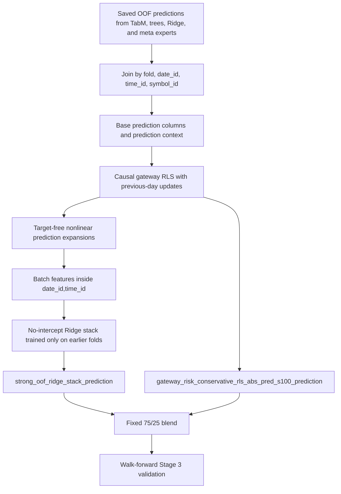
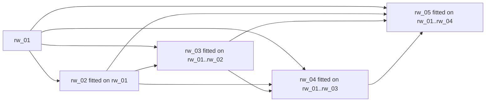

# Preserved Reference: Best Local Stage 3 Candidate

## Identity

```text
Short name:
batch_mean/std fixed blend

Experiment:
strong_oof_subset_s23aux8_s17_gateway_batch_mean_std_stage3_narrow_v1

Candidate:
fixed_blend_0_w0p75_fixed_blend

Local Stage 3 result:
global_r2=0.014424968604
min_fold_r2=0.008046148603
mean_fold_r2=0.014106538084
rows=11,028,424
```

This is the best preserved local Stage 3 validation result. It is not the most
conservative runtime artifact and it is not the best full historical
confirmation. Its role is to preserve the strongest recent local result and the
main technical lesson: target-free cross-sectional context over predictions
inside each `date_id,time_id` batch improves the stack.

## Fold Metrics

| Fold | Weighted zero-mean R2 |
| --- | ---: |
| `rw_01` | `0.014362370575` |
| `rw_02` | `0.027209033134` |
| `rw_03` | `0.009559255052` |
| `rw_04` | `0.011355883054` |
| `rw_05` | `0.008046148603` |

`rw_02` is strong, but the candidate is not a one-fold artifact: all folds are
positive and the worst fold is `0.008046148603`.

## Final Candidate Formula

The final candidate is a fixed blend:

```text
prediction =
  0.75 * strong_oof_ridge_stack_prediction
+ 0.25 * gateway_risk_conservative_rls_abs_pred_s100_prediction
```

Mathematically:

```text
y_hat_i = 0.75 * s_i + 0.25 * g_i
```

where:

- `s_i` is the walk-forward Ridge stack prediction over multiple experts and
  target-free expansions.
- `g_i` is the conservative gateway RLS prediction with causal `abs_pred`
  risk-modulated shrinkage at strength `s=100`.

The `0.75/0.25` blend is intentionally simple: most mass stays on the more
expressive OOF stack, while the conservative RLS term acts as a stabilizer.

## End-To-End Pipeline



## Input Components

The line uses strong saved OOF predictions from primary and meta families:

- TabM with official lags, `aux8` targets, multiple seeds, and online-update OOF
  artifacts.
- Tabular tree models, mainly XGBoost and LightGBM, with calibrated Ridge and a
  tree ensemble.
- A walk-forward convex baseline between TabM and trees.
- Causal gateway RLS over expert predictions.
- Risk-modulated RLS candidates.
- Extra TabM seeds from the `s23aux8_s17` family, completing the 14 model
  features reported by the experiment.

The line does not train a new primary model directly on current `responder_6`.
It works on existing OOF predictions and applies causal combination,
transformation, and calibration layers.

## Nonlinear Prediction Expansions

Before the final stack, expert predictions are enriched with target-free
transforms, for example:

```text
signed_square(p) = p * abs(p)
cube(p)          = p^3
pair_product(a,b)= a * b
```

These transforms test whether the relation between prediction and target is
slightly curved, asymmetric, or interactive across experts. They do not read the
current target.

## Batch/Cross-Sectional Context

The specific advance in this reference is computing statistics inside the
observable batch:

```text
batch = (date_id, time_id)
```

For each prediction column `p`, the stack may receive:

```text
batch_rank(p_i)   = ((rank_i - 1) / (n_batch - 1)) - 0.5
batch_mean(p_i)   = mean_batch(p)
batch_demean(p_i) = p_i - mean_batch(p)
batch_std(p_i)    = std_batch(p)
batch_zscore(p_i) = (p_i - mean_batch(p)) / std_batch(p)
```

The denominator is guarded: if the within-batch standard deviation is zero or too
small, `batch_zscore` is set to `0.0`.

These features are causal because all rows in a `date_id,time_id` batch are
observable together at prediction time. They do not use `responder_6`, future
dates, or later batches.

## Walk-Forward Ridge Stack

The stack is a no-intercept Ridge regression:

```text
beta_f = argmin_beta sum_{i in folds before f} w_i * (y_i - X_i beta)^2
         + alpha * ||beta||_2^2

s_i = X_i beta_f, for i in fold f
```

For the first fold there are no earlier folds, so the implementation uses a
default coefficient favoring the conservative prediction when available. For each
later fold, the coefficients are fitted only on earlier folds.

This preserves the walk-forward structure:



## Conservative RLS With Risk Shrinkage

The second blend term, `gateway_risk_conservative_rls_abs_pred_s100`, comes from
the conservative dynamic RLS:

```text
feature_set = experts
ridge_alpha = 10000
forgetting_factor = 0.995
```

The RLS keeps:

```text
P = precision matrix
b = right-hand side
beta = solve(P, b)
```

and updates causally:

```text
P_t = lambda * P_{t-1} + X_{t-1}' W_{t-1} X_{t-1}
b_t = lambda * b_{t-1} + X_{t-1}' W_{t-1} y_{t-1}
```

with `lambda=0.995`. The current day is predicted using only the state available
after incorporating previous-day lag delivery.

The `abs_pred` risk shrinkage reduces amplitude when posterior leverage and the
prediction magnitude imply higher risk:

```text
leverage_i = x_i' P^{-1} x_i
risk_i = leverage_i * (1 + abs(pred_i))
shrink_i = 1 / sqrt(1 + 100 * risk_i)
g_i = pred_i * shrink_i
```

## Data Geometry

This reference can be understood in three geometric spaces.

### 1. Expert Space

Each row becomes a vector:

```text
x_i = [pred_TabM, pred_tree, pred_xgb, pred_lgb, pred_ridge, pred_RLS, ...]
```

`responder_6` is a scalar direction approximated by a weighted linear projection.
Ridge learns a stable direction `beta` in this correlated expert space.

### 2. Cross-Sectional Fibers

Each `(date_id,time_id)` batch is a fiber: a simultaneous set of instruments.
The line uses geometry within that fiber:

- rank: ordinal position within the fiber;
- mean: local center;
- demean/zscore: coordinates relative to the center;
- std: local dispersion scale.

This changes the question from "what is the absolute prediction value?" to "where
is this row inside the market cross-section at this instant?".

### 3. Final Convex Segment

The `0.75/0.25` blend lies on the segment between two prediction surfaces:

```text
strong stack <---------------- prediction ----------------> conservative RLS
              weight 0.75                     weight 0.25
```

Topologically, it is a simple interpolation between a more flexible stack surface
and a smoother conservative RLS surface.

## Topological Intuition

The gain comes from replacing pointwise prediction with local-neighborhood
prediction. Without batch features, two rows with the same absolute prediction
are equivalent. With batch features, the same absolute prediction can mean
different things depending on the current cross-section.

In topological terms:

- `date_id,time_id` partitions the dataset into observable components.
- `batch_rank` preserves within-component order.
- `batch_demean` and `batch_zscore` provide local coordinates invariant to level
  shifts.
- `batch_mean` and `batch_std` carry information about the state of that
  component.

The stack learns a linear map on this augmented prediction manifold. The
improvement indicates that relative position inside the batch contains alpha not
fully captured by absolute expert predictions.

## Mathematical Assumptions

1. The objective is weighted zero-mean R2:

   ```text
   R2 = 1 - sum_i w_i (y_i - y_hat_i)^2 / sum_i w_i y_i^2
   ```

2. Saved OOF predictions are valid causal features for each validation row.

3. After nonlinear and batch-aware expansions, the relation between expert
   predictions and target is locally close enough to linear for Ridge to help.

4. Batch context is observable at prediction time.

5. Calibration learned on earlier folds remains useful for later folds.

6. Ridge regularization is necessary because prediction features are highly
   correlated.

7. The conservative RLS term stabilizes amplitude in higher-uncertainty regions.

## Anti-Leakage Audit

The experiment report recorded:

```text
target_leakage_check=passed
fold_causality_check=passed
selection_check=passed
gateway_bad_updates=0
```

Causality is enforced by four rules:

- the stack is trained only on earlier folds;
- RLS updates use previous-day lag delivery only;
- batch features use only predictions from the same `date_id,time_id` batch;
- no feature uses current `responder_6`.

## Related Historical Confirmation

The exact rule was frozen and confirmed under the historical `max_date_id=1398`
protocol:

```text
strong_oof_hist_max1398_s23aux8_s17_gateway_batch_mean_std_exact_v1
fixed_blend_0_w0p75_fixed_blend
global_r2=0.015621628372
min_fold_r2=0.011794008455
rows=11,151,360
```

That confirmation is strong, but it is about `0.000008543` below the preserved
historical `residual-tail` reference.

## Why It Is Preserved

This line is preserved because:

- it is the best validated local Stage 3 result;
- it shows that cross-sectional prediction context carries alpha;
- it improves over controls without batch mean/std;
- it passed causal audits;
- it provides an important technical ingredient for future batch-aware primary
  architectures.

## Why It Is Not The Main Operational Artifact

It is not the safest submission package because:

- it is an experimental OOF stack, not the primary Kaggle runtime artifact;
- it has more layers and degrees of freedom than the conservative RLS;
- it is slightly below the best full historical residual-tail result;
- the improvement is still far from `0.02`, so it does not prove a large
  structural jump.

## Recommended Use

Use this reference as:

- the local Stage 3 benchmark;
- evidence that batch/cross-sectional context matters;
- an ingredient for comparing future primary alphas;
- the minimum bar for any new OOF integration in the recent window.

Do not use it as:

- official leaderboard evidence;
- a guarantee of operational robustness;
- justification for more cheap grid search without a new hypothesis.
