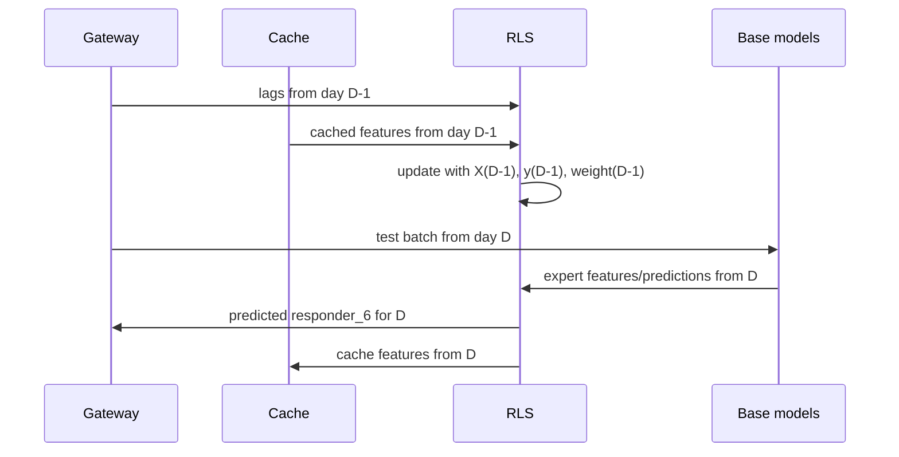

# Preserved Reference: Conservative Operational Candidate

## Identity

```text
Short name:
conservative dynamic gateway RLS

Candidate:
dynamic_gateway_rls_experts_alpha10000_f0p995

Local Stage 3:
global_r2=0.013836465
min_fold_r2=0.007030887
rows=11,028,424

Historical max1398:
global_r2=0.015425344
min_fold_r2=0.012924724
rows=11,151,360
```

This is the preserved reference with the highest operational confidence. It does
not have the best local score, but it is the simplest, most causal, and most
portable line for the submission contract: a dynamic RLS meta layer over expert
predictions.

## Role Among The Three References

```text
Best local Stage 3:
batch_mean/std fixed blend, global_r2=0.014424968604

Best full historical:
residual-tail, global_r2=0.015630171202

Lowest operational risk:
dynamic_gateway_rls_experts_alpha10000_f0p995
```

The goal of this line is not to maximize every micro-gain. It is to preserve a
strategy that can be explained, audited, exported, and run in the gateway with
low breakage risk.

## Metrics

### Stage 3

| Metric | Value |
| --- | ---: |
| `global_r2` | `0.013836465051` |
| `mean_fold_r2` | `0.013455621657` |
| `min_fold_r2` | `0.007030887451` |
| `max_fold_r2` | `0.026561885615` |
| `rows` | `11,028,424` |

### Historical max1398

| Metric | Value |
| --- | ---: |
| `global_r2` | `0.015425343844` |
| `mean_fold_r2` | `0.015235102421` |
| `min_fold_r2` | `0.012924723719` |
| `max_fold_r2` | `0.020255762537` |
| `rows` | `11,151,360` |

## End-To-End Pipeline

```mermaid
flowchart TD
    A[Base models: TabM, Ridge, XGBoost, LightGBM, tree ensemble] --> B[Batch predictions]
    B --> C[experts feature set]
    C --> D[RLS state: precision P and rhs b]
    D --> E[beta = solve(P,b)]
    E --> F[current prediction x beta]
    F --> G[cache current-day features]
    H[Gateway lags on next day] --> I[Join lags with cached previous-day features]
    I --> J[Causal RLS update]
    J --> D
    F --> K[row_id, responder_6]
```

## `experts` Feature Set

The conservative strategy uses the `experts` feature set. In the gateway
simulation, this set is built from available prediction columns, including:

```text
baseline_prediction
tabm_prediction
tree_prediction
xgboost_prediction
lightgbm_prediction
ridge_calibrated_prediction
```

Not every artifact must contain every column; the code keeps the available ones.
The idea is simple: each row is represented by the opinions of multiple tabular
experts.

## Prior And Regularization

The initial state is:

```text
P_0 = alpha * I
b_0 = alpha * beta_prior
alpha = 10000
```

The prior favors a known base prediction:

```text
if baseline_prediction exists:
    beta_prior[baseline_prediction] = 1
else if tabm_prediction exists:
    beta_prior[tabm_prediction] = 1
all other coefficients = 0
```

The large `alpha=10000` is what makes the line conservative. It anchors the model
near the prior and requires substantial weighted evidence before coefficients
move.

## RLS Update With Forgetting

For each causal update:

```text
P_t = lambda * P_{t-1} + X' W X
b_t = lambda * b_{t-1} + X' W y
beta_t = solve(P_t, b_t)
```

with:

```text
lambda = 0.995
```

Interpretation:

- `P` accumulates the weighted expert geometry.
- `b` accumulates weighted correlation between experts and target.
- `lambda < 1` applies mild forgetting, giving slightly more weight to the
  recent regime.
- `beta` is the current linear combination of experts.

## Gateway Simulation

The simulated protocol follows the operational rule:

```text
At the start of day D:
    receive lags from D-1
    join responder_6_lag_1 with cached features from D-1
    update RLS
    predict all batches of D
    cache features from D for future update
```

The target of `D` is never used to predict `D`.



## Submission Contract

The operational implementation uses:

- `src/janestreet/submission_inference.py`: RLS state, feature cache, lag update,
  and `predict(test, lags)` contract.
- `src/janestreet/submission_artifacts.py`: RLS state training, export, and load.
- `src/janestreet/submission_models.py`: base model loading.
- `submission/submission.py`: `JSInferenceServer` entrypoint.
- `scripts/build_kaggle_late_submission_package.py`: candidate packaging.

The selected package uses:

```text
artifacts/jane_street_submission/meta_rls_experts_alpha10000_f0p995/rls_state.npz
```

The manual Kaggle package was prepared as a private dataset/kernel. The remote
notebook produced a `submission.parquet` with the correct schema, but the final
submission call was blocked by the platform because submissions were disabled for
the competition.

## Prediction Formula

For row `i`:

```text
x_i = vector of expert predictions
beta_t = solve(P_t, b_t)
y_hat_i = x_i beta_t
```

The local R2 is:

```text
R2 = 1 - sum_i w_i (y_i - y_hat_i)^2 / sum_i w_i y_i^2
```

The metric is zero-mean because the denominator compares against a zero
prediction rather than the weighted target mean.

## Data Geometry

### Expert Space

Each row becomes a point in a low-dimensional space:

```text
x_i = [baseline, tabm, tree, xgb, lgb, ridge]
```

The RLS learns a direction `beta` in that space. Prediction is the projection of
`x_i` onto that direction.

### Precision Metric

The precision matrix `P` defines a local geometry:

```text
||v||_P^2 = v' P v
```

When data strongly confirms a direction, precision grows along that direction.
Where evidence is weak, the prior remains dominant.

### Posterior Ellipsoid

The inverse `P^{-1}` behaves like an approximate covariance matrix. High
uncertainty directions are wide axes of the ellipsoid; well-observed directions
are narrow axes. The conservative strategy uses large regularization to keep this
ellipsoid controlled.

## Topological Intuition

Topologically, this line does not create hard boundaries or tail masks. It keeps
a continuous surface:

```text
y_hat = x beta_t
```

That surface moves slowly over time because of:

- a strong prior;
- mild forgetting;
- causal daily updates;
- a small expert feature set.

Compared with residual-tail, the topology is less fragmented: there is no
piecewise gluing of surfaces. That reduces operational risk.

## Mathematical Assumptions

1. A linear combination of experts is sufficient to capture most portable alpha.

2. Expert errors are partially different, so combining them improves stability.

3. The regime changes slowly enough for `lambda=0.995` to be useful.

4. A strong prior is preferable to unstable coefficients in small windows.

5. The target delivered as previous-day lag is exactly the information available
   in the real gateway.

6. The weighted metric justifies updates through `X' W X` and `X' W y`.

## Anti-Leakage Audit

The simulation and packaging enforce causality by design:

- updates use only the previous day's `pending_update`;
- `_deliver_previous_day_lags` requires `previous_date < current_date`;
- the cache joins `responder_6_lag_1` to cached previous-day features;
- duplicate updates are blocked by `last_meta_update_date_id`;
- prediction returns only `row_id` and `responder_6`;
- audits recorded `bad_updates=0` and `all_strictly_past=true`.

## Difference Between OOF Validation And Kaggle Artifact

The competitive OOF stack can include online-training details in base models. The
operational package primarily validates:

- base model loading;
- RLS serialization;
- the `predict(test, lags)` contract;
- online update of the RLS meta layer;
- final submission schema.

A documented limitation is that the artifact loader did not implement TabM
online update in the submission package; the operational online update validated
here is the RLS update. Therefore this document treats the line as conservative
and operational, not as a perfect reproduction of every experimental OOF detail.

## Why It Is Preserved

It is preserved because:

- it has the best combination of simplicity, causality, and portability;
- it was confirmed on both Stage 3 and historical protocols;
- it has a gateway/submission implementation;
- it uses a small number of auditable mathematical components;
- it avoids piecewise masks and tail grids;
- it is the robustness checkpoint before any new meta-layer.

## Risks

The main risks are:

- lower score than experimental lines;
- dependence on the quality of base models;
- possible OOF/package differences if base models do not reproduce every online
  detail;
- no current official leaderboard evidence, because the competition was closed
  for submissions.

## Recommended Use

Use this reference as:

- the operational fallback;
- the lowest-risk mental package;
- the conservative baseline for new integrations;
- the preferred candidate when portability matters more than local micro-gain.

Do not use it as:

- the best local score;
- the best historical score;
- proof that the methodological ceiling is `0.0138`;
- a reason to ignore the positive evidence from batch context and residual tail.
