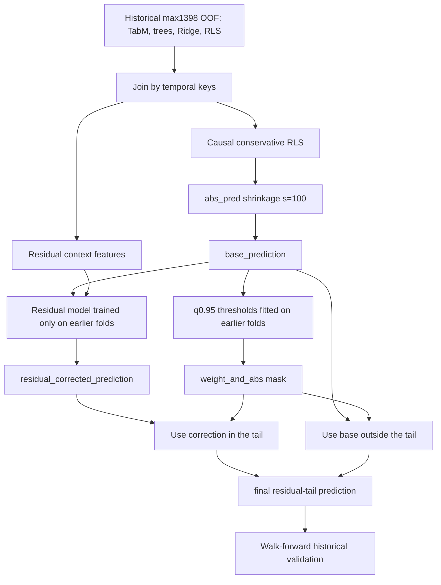

# Preserved Reference: Best Full Historical Candidate

## Identity

```text
Short name:
historical residual-tail

Experiment:
strong_oof_hist_max1398_gateway_residual_tail_modes_v1

Candidate:
gateway_risk_conservative_rls_abs_pred_s100_prediction_residual_weight_and_abs_q0p95_residual_tail

Full historical max1398 result:
global_r2=0.015630171202
min_fold_r2=0.012909969695
mean_fold_r2=0.015416459998
rows=11,151,360
```

This is the best preserved full historical validation reference. It should be
read as the strongest competitive experimental candidate on the broader
historical protocol, not as the simplest operational runtime artifact.

## Fold Metrics

| Fold | Weighted zero-mean R2 |
| --- | ---: |
| `rw_01` | `0.016288663434` |
| `rw_02` | `0.012909969695` |
| `rw_03` | `0.013598699183` |
| `rw_04` | `0.013459269316` |
| `rw_05` | `0.020825698360` |

The strength of this line is historical robustness: the worst fold remains above
`0.0129`, and the global score is slightly above the historical confirmation of
the batch mean/std line.

## Conceptual Formula

The final prediction is piecewise:

```text
if row is in the weight_and_abs q0.95 tail:
    prediction = residual_corrected_prediction
else:
    prediction = base_prediction
```

where:

```text
base_prediction =
  gateway_risk_conservative_rls_abs_pred_s100_prediction

residual_corrected_prediction =
  base_prediction + residual_model(context_features)
```

The full candidate name encodes the rule:

```text
gateway_risk_conservative_rls_abs_pred_s100_prediction
  _residual_weight_and_abs_q0p95_residual_tail
```

Meaning:

- base: conservative RLS with `abs_pred` risk shrinkage at strength `100`;
- residual: linear residual correction;
- tail: apply the correction only when both `weight` and `abs(base_prediction)`
  exceed historical 0.95 quantile thresholds.

## End-To-End Pipeline



## Base: Conservative RLS With Risk Shrinkage

The base prediction is:

```text
gateway_risk_conservative_rls_abs_pred_s100_prediction
```

It derives from the conservative RLS:

```text
feature_set = experts
ridge_alpha = 10000
forgetting_factor = 0.995
```

The RLS fits a linear combination of expert predictions and updates causally:

```text
P_t = lambda * P_{t-1} + X_{t-1}' W_{t-1} X_{t-1}
b_t = lambda * b_{t-1} + X_{t-1}' W_{t-1} y_{t-1}
beta_t = solve(P_t, b_t)
pred_i = x_i beta_t
```

Risk shrinkage reduces amplitude when posterior leverage and prediction
magnitude imply higher risk:

```text
leverage_i = x_i' P_t^{-1} x_i
risk_i = leverage_i * (1 + abs(pred_i))
base_i = pred_i / sqrt(1 + 100 * risk_i)
```

## Residual Model

After the base prediction, the pipeline fits a correction to:

```text
residual_i = y_i - base_i
```

The residual features recorded by the experiment are:

```text
prediction_disagreement
tabm_tree_diff
abs_baseline_prediction
weight
```

The fit is a linear Ridge regression on standardized features, using only earlier
folds:

```text
gamma_f = argmin_gamma
  sum_{i in folds before f} w_i *
  (residual_i - z_i gamma)^2
  + 1000 * ||gamma||_2^2

residual_corrected_i = base_i + z_i gamma_f
```

For the first fold, no residual correction is promotable, so prediction remains
the base.

## Tail Mask

The residual correction is not applied to every row. It is applied only in:

```text
mode = weight_and_abs
quantile = 0.95
```

Thresholds are fitted on earlier folds:

```text
weight_threshold   = quantile(weight, 0.95)
abs_base_threshold = quantile(abs(base_prediction), 0.95)

tail_i =
  weight_i >= weight_threshold
  AND abs(base_i) >= abs_base_threshold
```

Then:

```text
y_hat_i =
  residual_corrected_i, if tail_i
  base_i, otherwise
```

This is the core hypothesis: do not correct the whole surface; correct only rows
where the metric is more sensitive and the base model expresses stronger
conviction.

## Tail Size

In the historical artifact, the `weight_and_abs q0.95` mask selected only a small
fraction of later folds:

| Fold | Selected rows | Fraction |
| --- | ---: | ---: |
| `rw_01` | `0` | `0.000000` |
| `rw_02` | `15,351` | `0.006874` |
| `rw_03` | `2,508` | `0.001125` |
| `rw_04` | `6,720` | `0.002990` |
| `rw_05` | `21,579` | `0.009908` |

This confirms that the rule is a tail correction, not a broad new alpha.

## Data Geometry

The line operates over three geometric regions.

### 1. Conservative Base Surface

The conservative RLS produces a smooth surface in expert-prediction space. The
large `ridge_alpha=10000` keeps the surface close to the prior and dampens
unstable coefficient movement.

### 2. Local Residual Field

The residual model estimates a small vector field:

```text
delta_i = residual_model(z_i)
```

This field tells how to shift the base surface as a function of predictor
disagreement, TabM/tree difference, baseline magnitude, and weight.

### 3. Tail Subset

The `weight_and_abs` mask defines a high-importance subregion:

```text
tail = {i | weight_i is high and |base_i| is high}
```

Topologically, the final prediction glues two surfaces:

- outside the tail: conservative base surface;
- inside the tail: base surface shifted by the residual model.

There is a discrete boundary at the quantile thresholds. That increases local
power, but also increases regime sensitivity.

## Topological Intuition

The method stratifies validation space:

```text
common stratum:   use conservative base
tail stratum:     use base + residual correction
```

The topological hypothesis is that residual geometry is not uniform. In low
metric-importance or low-conviction regions, correction may add noise. In
high-weight and high-magnitude regions, small corrections can matter
disproportionately to the weighted metric.

This stratification explains the strong historical result and also the risk: if
the tail boundary moves under a new regime, the correction may become
miscalibrated.

## Mathematical Assumptions

1. The conservative RLS base already captures most usable signal.

2. The base residual is not pure noise; it has structure in:

   ```text
   prediction_disagreement, tabm_tree_diff, abs_baseline_prediction, weight
   ```

3. That residual structure is more reliable in high-importance tails.

4. Quantiles of `weight` and `abs(base_prediction)` learned on earlier folds
   remain useful for later folds.

5. The piecewise rule improves the bias-variance tradeoff by avoiding weak
   corrections across the full body of the distribution.

6. Weighted R2 rewards improvements on high-`weight` rows, provided the
   correction does not over-increase squared error.

## Anti-Leakage Audit

The final report recorded:

```text
target_leakage_check=passed
fold_causality_check=passed
selection_check=passed
gateway_bad_updates=0
```

The main protections are:

- RLS updates use previous-day lag simulation;
- the residual model is fitted only on earlier folds;
- tail thresholds are fitted only on earlier folds;
- the tail mask uses only `weight`, `abs(base_prediction)`, and past calibration
  statistics;
- current `responder_6` is never used to decide whether correction applies.

## Why It Is Preserved

It is preserved because:

- it has the best validated full historical `global_r2`;
- it has a strong historical worst fold;
- it uses an audited causal rule;
- it improves the conservative base in a high metric-importance region;
- it is the strongest competitive experimental candidate.

## Risks

Its risks are higher than the conservative RLS:

- the rule is piecewise and depends on quantile boundaries;
- the correction is concentrated in a small number of rows;
- tails are more sensitive to regime drift;
- distribution shifts can change which rows receive correction;
- the gain is local historical evidence, not official leaderboard evidence.

## Relation To Other Preserved References

```text
Best local Stage 3:
batch_mean/std fixed blend, global_r2=0.014424968604

Best full historical:
this residual-tail line, global_r2=0.015630171202

Most conservative operational:
dynamic_gateway_rls_experts_alpha10000_f0p995,
Stage 3 global_r2=0.013836465,
historical global_r2=0.015425344
```

The residual-tail line is the competitive experimental choice. For the lowest
operational risk package, the conservative RLS remains more defensible.

## Recommended Use

Use this reference as:

- the best full historical benchmark;
- the competitive experimental candidate;
- evidence that weighted tails contain residual signal;
- a required comparison point for any new historical confirmation.

Do not use it as:

- the safest operational artifact;
- proof of robustness outside local data;
- justification for more tail tuning without independent validation.
